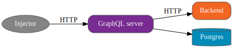

= GraphQL server benchmark

Benchmark of a simple https://graphql.org/[GraphQL] server on popular spec implementations.

== Lastest results

link:results/round1/results.adoc[Round 1]

== The benchmark

The benchmark consists in a simple blogging GraphQL server:

* fetching json (author profiles) from a remote HTTP server
* reading rows (posts and comments) from a Postgres database

[source]
.Schema file
----
type Post {
    author: Author!
    title: String!
    content: String!
    comments: [Comment!]
}

type Comment {
    author: Author!
    post: Post!
    content: String!
}

type Author {
    firstName: String!
    lastName: String!
    bio: String!
    posts: [Post!]
    comments: [Comment!]
}

type Query {
    posts: [Post!]
    author(id: Int!): Author
}
----

The backend HTTP service is setup with 10 authors.

The Postgres database is setup with:

* 2 posts per author
* 2 comments per post:
** 1 comment from another author
** 1 comment (reply) from the post author

Each framework is tested with different link:queries.adoc[queries].

== Guidelines

The server must:

* accept the `BACKEND_HOST` environment variable for configuration
* accept the `POSTGRES_HOST` environment variable for configuration

The server may:

* cache author profiles per-query
* use HTTP and Postgres pipelining

The server must not:

* cache all posts and comments
* cache all author profiles

== Test environment

* 3 quad-core servers Intel Xeon e5-2637v3 128G RAM (injector, server, backend)
* 1 quad-core server Intel Xeon e5-2637v3 256G RAM (postgres)
* 10 GbE switch

== Contributing

You can add an implementation in the link:implementations/[implementations] directory.

Make sure the name describes the software stack.
For example, _Java/vertx-graphql-java_ means the implementation:

* is written in the Java language
* uses Vert.x as the web server
* uses GraphQL-Java engine

Each implementation must provide a `Dockerfile` (build and run).

For testing purposes, you can build and run with Docker:

* the link:backend/[backend] server
* the link:postgres/[postgres] database

== License

link:LICENSE[Apache 2.0 License]
